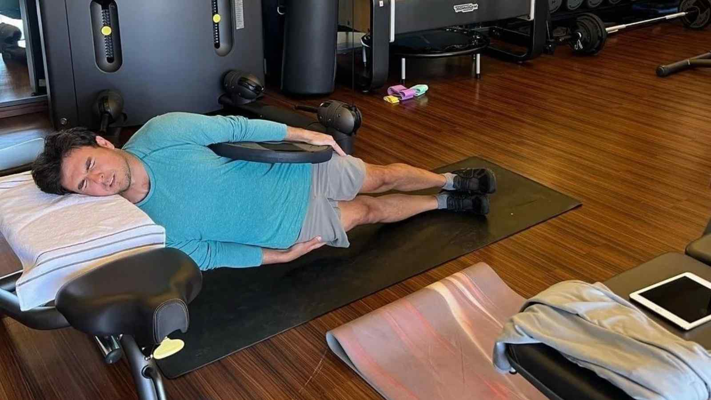
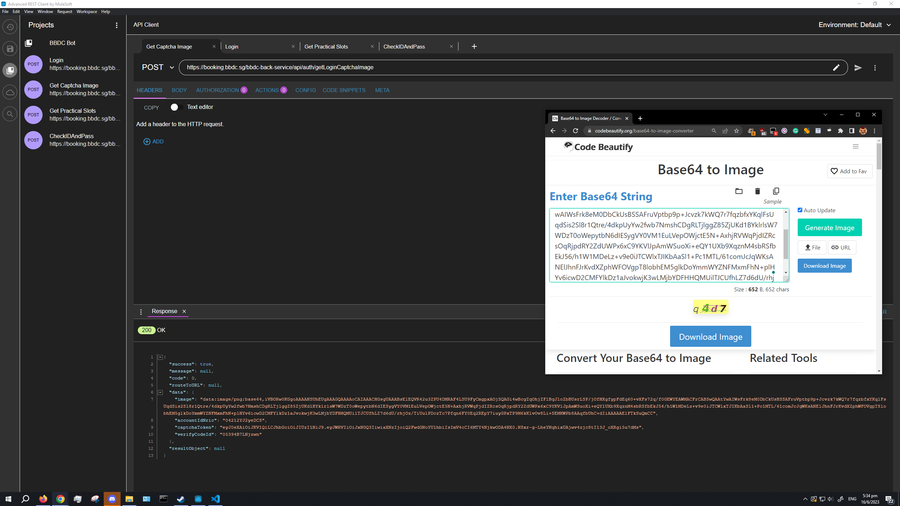
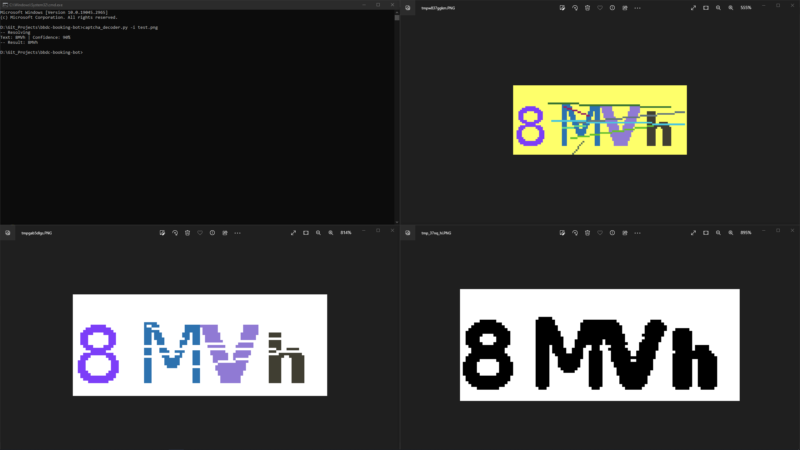
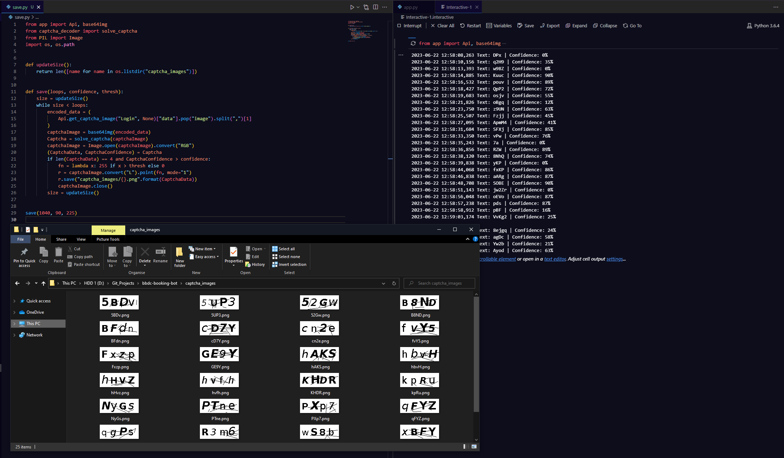
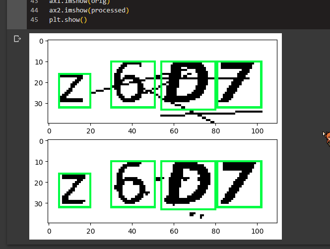
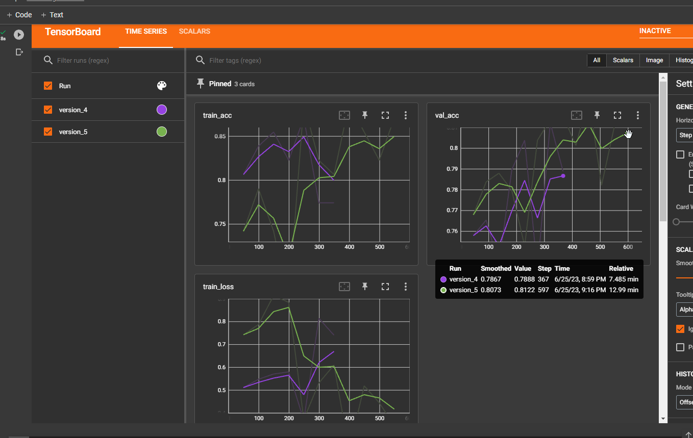
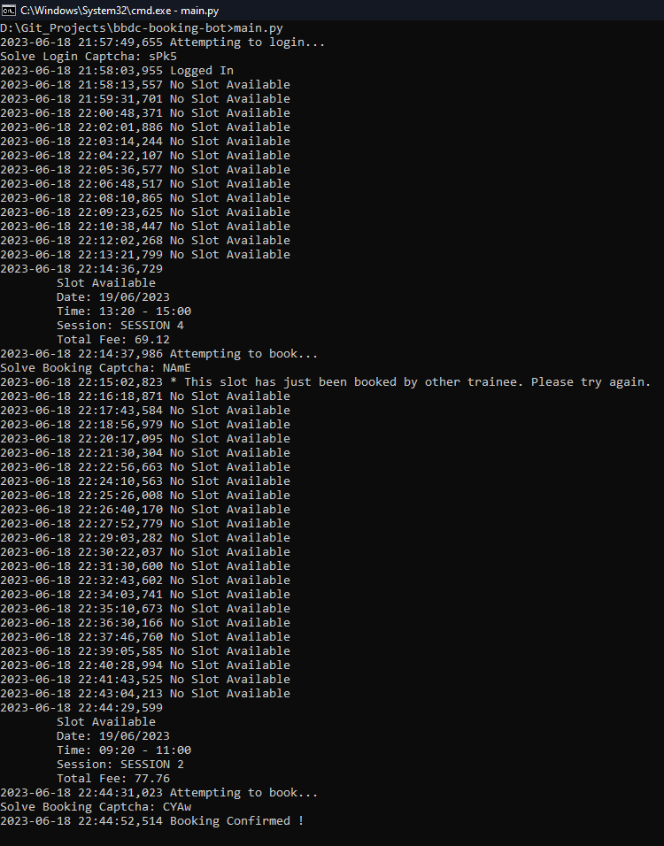
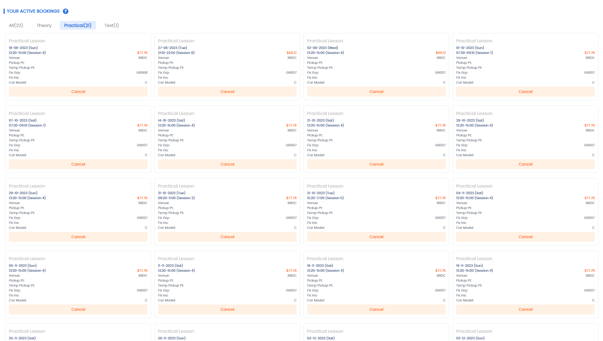

# TensorFlow OCR model for solving BBDC Login Captchas
Developed a 2023 side project to train a model that solves CAPTCHAs generated by BBDC's login system, automating the booking of practical slots.



> [!TIP]
> And when I'm old and I've had my fun, I'll share my inventions so that everyone can be superheroes.  
Everyone can be a super!  
[And when everyone's super… no one will be.](https://youtu.be/ea8ebpKM2JU)

### 🚨🚨🚨 Important Alert 🚨🚨🚨
> [!WARNING]
> This repository serves as an archive of the methods I used during my past project. Please be aware that this and [the relevant repositories](https://github.com/lolkabash/bbdc-booking-bot) are **NOT GURANTEED** to work in their current state. Some tinkering may be required, as I no longer maintain them.  

> [!IMPORTANT]
> I deeply value any feedback and appreciate all the feedback to improve the exisitng code. However, this is no longer an active project of mine so feel free to create a fork and continue building on the work that has been done.  
> Thank you for your understanding!

## Prerequisites:
* [Python3](https://www.python.org/downloads/)
* [Tesseract](https://tesseract-ocr.github.io/tessdoc/Installation.html)
* [TensorFlow](https://www.tensorflow.org/install)
* [mltu](https://pypi.org/project/mltu/)
* [Advance Rest Client](https://install.advancedrestclient.com/)
* [Google Collab](https://colab.research.google.com/)

## Building Dataset - General Workflow:
1. Retrieve captcha JSON payload from `https://booking.bbdc.sg/bbdc-back-service/api/auth/getLoginCaptchaImage` using `Advance Rest Client` with a **POST request**.
2. From the JSON Payload decode the `base64` string into an `image` to build your dataset.
    - https://codebeautify.org/base64-to-image-converter
- Example:
    - Refer to [example-response-body.json](example-response-body.json)
    - Go to `["data"]["image"]`field.
    - Extract Base64 string from `data:image/png;base64, <Base64 String>`.
    - Convert it from Base64 to an image using the above converter OR in Python3 using the following code.
    ```py
    import base64
    img_data = "<Base64 String>"
    with open("imageToSave.png", "wb") as fh:
        fh.write(base64.decodebytes(img_data))
    ```
3. Repeat ~1000x to obtain a suitable size for your dataset.
4. Label each image based on the **ACTUAL** captcha for easier evaluation.
5. Split the dataset into `90% Training` / `10% Validation`.
6. Train the model using the attached [captcha_solver.ipynb](captcha_solver.ipynb) file utilising `Google Collab T4 GPU` runtime.
7. Download trained model for use with [BBDC Booking Bot](https://github.com/lolkabash/bbdc-booking-bot)

## BBDC Booking Bot
- https://github.com/lolkabash/bbdc-booking-bot

## References
- https://pylessons.com/tensorflow-ocr-captcha
- https://github.com/pythonlessons/mltu/tree/main/Tutorials/02_captcha_to_text#tensorflow-ocr-model-for-reading-captchas

## Project Snapshots
### Building Dataset


### Confidence Testing




### TensorBoard Report


### Proof of Functionality

